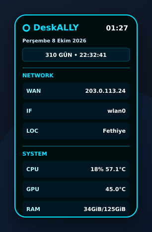

# KundALLY Panel



KundALLY Panel, Linux masaüstü için küçük ve sürüklenebilir bir sistem bilgi panelidir. CPU, GPU, RAM ve ağ durumunu tek bakışta gösterir. Başlık çubuğu gerektirmez; panelin herhangi bir yerine sol tuşla basıp sürüklenebilir.

## Özellikler

- Fareyle doğrudan sürükleme ve son konumu hatırlama
- CPU kullanımı ve sıcaklığı
- GPU sıcaklığı
- RAM kullanımı
- Ağ arayüzü, arayüzün yerel IP adresi, genel WAN IP'si ve şehir bilgisi
- Türkçe tarih, saat ve ayarlanabilir geri sayım
- Sağ tıkla açılan ayar menüsü
- Takvim ve saat kutularıyla ayarlanabilen kronometre
- Değiştirilebilir panel adı, görsel renk seçici ve genişlik
- Oturum açılışında otomatik başlatma
- Debian, Ubuntu, Linux Mint ve GTK 3 kullanan diğer X11 masaüstleri

## Gereksinimler

Debian ve türevlerinde:

```bash
sudo apt install python3 python3-gi gir1.2-gtk-3.0
```

GPU ve CPU sıcaklıklarının daha geniş donanım desteğiyle görünmesi için isteğe bağlı olarak:

```bash
sudo apt install lm-sensors
```

## Kurulum

Depoyu indirip proje dizininde şu komutu çalıştır:

```bash
./install.sh
```

Kurulum yönetici yetkisi istemez. Dosyalar kullanıcının `~/.local` dizinine kurulur ve panel hemen başlatılır.

## Kullanım

- **Taşı:** Panelin herhangi bir yerinde sol tuşa basılı tutup sürükle.
- **Menü:** Panele sağ tıkla.
- **Ayarlar:** Sağ üstteki **⚙** düğmesine bas veya sağ tık → **Ayarlar**. Buradan kronometre günü ve saati, panel adı, rengi ve genişliği değiştirilebilir.
- **Başlat:** `kundally-panelctl start`
- **Kapat:** `kundally-panelctl stop`
- **Yeniden başlat:** `kundally-panelctl restart`
- **Günlük:** `kundally-panelctl logs`

Ayarlar `~/.config/kundally-panel/config.json`, çalışma durumu ise `~/.local/state/kundally-panel` altında saklanır.

## Kaldırma

```bash
./uninstall.sh
```

Kaldırma işlemi kişisel ayar dosyanı silmez.

## Gizlilik

Genel IP ve şehir satırları açıksa panel, genel IP için Cloudflare trace hizmetine ve şehir için ipinfo.io'ya kısa ağ istekleri gönderir. Bu satırlar ayarlardan ayrı ayrı kapatılabilir. Sistem bilgileri bilgisayardan dışarı gönderilmez.

## Geliştirme

Kaynak dizininde:

```bash
python3 -m unittest discover -s tests -v
python3 -m kundally_panel
```

Katkılar ve hata bildirimleri açıktır.

## Lisans

[MIT](LICENSE)
